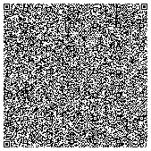

# QR Code Apps

## What is it?
Collection of miniature apps/minigames that fit into a single QR code.
All apps follow same rules:

- **Fit within single QR code**. Any tricks are okay as long as QR code is scannable.
- **Do not require any external resources**. Apps are fully operable if scanned from paper ("hard copy") without internet connection on scanning device.

## How to use?
These codes can be scanned by your device of choice and content pasted directly into browser URL.
Since QR code content is [Data URL](https://en.wikipedia.org/wiki/Data_URI_scheme), it contains everything needed within itself.

## Why would you do that?
For fun, challenge and as a demonstration of modern browser capabilities.
Fitting entire app in one QR code also keeps them relatively small and simple... until author tries to squeeze code too hard and it becomes unreadeable 😂

## How does it work?
Each app is HTML/JS/CSS webpage contained within own directory in `apps`. Scripts `qr.py` and `qrs.py` will convert each app into [QR code](https://en.wikipedia.org/wiki/QR_code) by 'minifying'/'uglyfying' it and inlining all JS/CSS/whatever into single HTML. This HTML then encoded as [Data URL](https://en.wikipedia.org/wiki/Data_URI_scheme) and QR code of said URL is generated.

## Collection of QR apps!
Generated automatically on push and published to https://worldemar.github.io/qrapps/
### [demo-canvas](demo-canvas/minibundle.html)

Simple demo showcasing mouse tracking and canvas drawing

### [demo-clock](demo-clock/minibundle.html)

Simplest demo showcasing proof-of-concept.

### [demo-glcube](demo-glcube/minibundle.html)

Simple demo showcasing rotating cube using WebGL.
Uses internal 600-character matrix library and no engine.
Fitting it into QR code was not easy nor pretty, some parts of code are not very readable.
Building more complex WebGL app would likely require different approach (shaders?)
or more agressive minifying/uglifying

