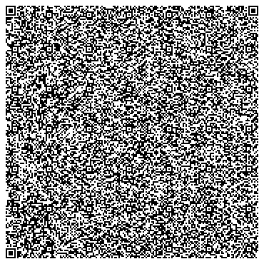
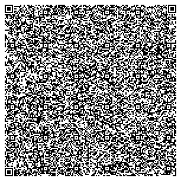

# QR Code Apps

## What is it?
Collection of miniature apps/minigames that fit into a single QR code.
All apps follow same rules:

- **Fit within single QR code**. Any tricks are okay as long as QR code is scannable.
- **Do not require any external resources**. Apps are fully operable if scanned from paper ("hard copy") without internet connection on scanning device.

## How to use?
These codes can be scanned by your device of choice and content pasted directly into browser URL.
Since QR code content is [Data URL](https://en.wikipedia.org/wiki/Data_URI_scheme), it contains everything needed within itself.

## How to contribute?
- Create directory in `apps` with appropriate name, then add to it:
    - `index.html` - main app layout file
    - `index.js` - app source code
    - `minify.json` and `uglify.json` - compression configs
    - `README.md` - app description

    (see `demo-*` apps for file content examples)
- Use build instructions from [Dockerfile](Dockerfile)

## Why would you do that?
For fun, challenge and as a demonstration of modern browser capabilities.
Fitting entire app in one QR code also keeps them relatively small and simple... until author tries to squeeze code too hard and it becomes unreadeable 😂

This is also a good source of compact code examples. Some of them were inspired by examples I had found, but stripped down from all the fluff and simplified. Instead of including some 10kb+ libraries and then having 3-line example, these are within 200 lines of code and nothing is hidden from you.

## How does it work?
Each app is HTML/JS/CSS webpage contained within own directory in `apps`. Scripts `qr.py` and `qrs.py` will convert each app into [QR code](https://en.wikipedia.org/wiki/QR_code) by 'minifying'/'uglyfying' it and inlining all JS/CSS/whatever into single HTML. This HTML then encoded as [Data URL](https://en.wikipedia.org/wiki/Data_URI_scheme) and QR code of said URL is generated.

## Collection of QR apps!
Generated automatically on push and published to https://worldemar.github.io/qrapps/
### [demo-shader](demo-shader/index.html)

Simple demo showcasing fragment shader using WebGL.
Contains minimal (about 50 lines, just over 1kb compressed) of boilerplate code to run single fragment shader.
Mandelbrot set shader added for demonstration purposes based on [WebGL101](https://github.com/emoller/WebGL101) fragment shader example. Controls are cursor keys, `+` and `-`.

### [spectrogram](spectrogram/index.html)

A relatively straightforward implementation of spectrogram.
The QR for this app might be rather useless, since `mediaDevices`
are only available for HTTPS on Android devices and not available
for Data URL on any platform I have available.

### [demo-geometry](demo-geometry/index.html)

Geometry demo inspired by old ZX Spectrum demoscene.

### [demo-shader-julia](demo-shader-julia/index.html)

Demo showcasing interactive fragment shader using WebGL.
Displays julia set with pan, zoom and ability to move constant point by drag-and-drop.

Worst thing about shaders - they cannot be minified automatically.
This forces manual "minification" which results in VERY unreadable code.
Loading external shader file is rather difficult to implement within Data URL.

### [demo-clock](demo-clock/index.html)

Simplest demo showcasing proof-of-concept.

### [bike-chain-wear-calculator](bike-chain-wear-calculator/index.html)

Bike chain wear calculator. Displays relative bike chain wear for cases when chainring has common divisors with chain length. Choosing these incorrectly may cause certain chain segments to wear way more than others and chain becoming unusable much earlier than it's designed lifespan.

### [sudoku-solver](sudoku-solver/index.html)

Simple sudoku solving helper. Use **lock** button to lock puzzle values and **clear** to erase user-selected solution values.

This solver highlights possible values for unfilled cells. All values put on the board are not questioned or checked. Solver assumes that user inputs are not self-contradictory and do not violate sudoku rules. 

This solver also _does not_ try to solve anything that is not directly put on the sudoku board. No cell values are assumed (except for cells that are limited to a single value by sudoku rules), no secondary boards solved with possible values, no heuristics, X-wing, Y-wing, Swordfish, XYZ-wing or any other advanced techniques applied.

**This helper only checks for basic sudoku rules and consequences to them**:
- unique values in: rows, columns, quadrants (contemporary sudoku rules)
  - A row/column/quadrant must not have more than **one** occurence of every single value.
    - if row/column/quadrant has a cell with certain value then that value is excluded from possible values for other cells in that row/column/quadrant.
- sufficient sets in: rows, columns, quadrants (a generalized version of rules above)
  - A row/column/quadrant must not have more than N cells that are limited to same value range of length N.
    - if row/column/quadrant has N (say, three) cells with same set of N (say, three) possible values (say, [X,Y,Z]), then no other cell in that row/column/quadrant could possible have either X, Y or Z, otherwise duplicates are inevitable. All other cells in row/column/quadrant would have these values excluded from their possible value sets. *Same applies to value sets of any length.*
    - if row/column/quadrant has _more_ than N (say, three) cells with same set of possible values of length N (say, [5,7,9]), then all of these cells could not possibly have values assigned to them, there is simply not enough possible values to fill each one, thus these cells are marked as contradictory (i.e. - error). *In this case current solution obviously already has an error, and there is no reason to go further*

Please note, that even this very simple solver witout any heuristics whatsoever is powerful enough to resolve most sudoku puzzles except really hard ones. Usage of this tool *may* decrease your enjoyment of solving sudoku by yourself. I enjoyed writing it, though 😄

### [demo-glcube](demo-glcube/index.html)

Simple demo showcasing rotating cube using WebGL.
Uses internal 600-character matrix library and no engine.
Fitting it into QR code was not easy nor pretty, some parts of code are not very readable.
Building more complex WebGL app would likely require different approach (shaders?)
or more agressive minifying/uglifying

### [demo-canvas](demo-canvas/index.html)

Simple demo showcasing mouse tracking and canvas drawing

